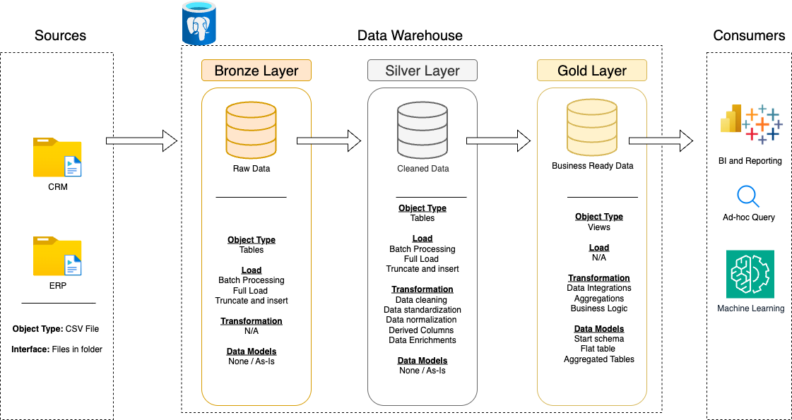
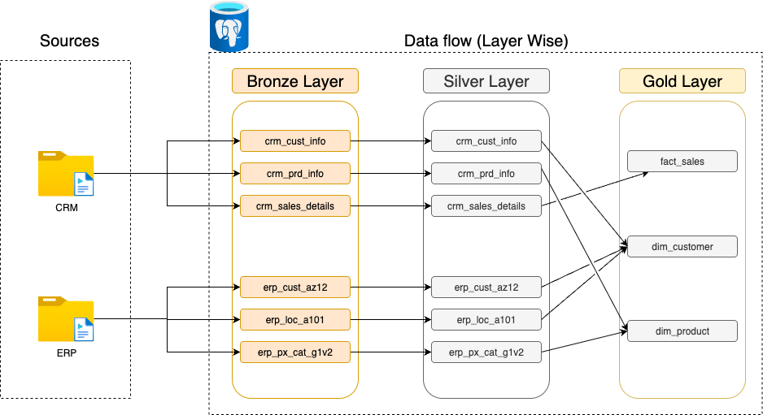

# sql-data-warehouse-project
Building a modern data warehouse with PostgresSQL (ETL, Data Modeling, Analytics)

*The following diagram shows the overall architecture of the SQL data warehouse, including the Bronze, Silver, and Gold layers for data ingestion, transformation, and analytics.*

*The following diagram illustrates how data moves through the pipeline — from raw source systems into staging (bronze), then transformed (silver), and finally aggregated and modeled (gold) for reporting.*

*The following model describes how different datasets (CRM, ERP, Sales, etc.) are integrated together in the warehouse to provide a unified view of business operations.*

